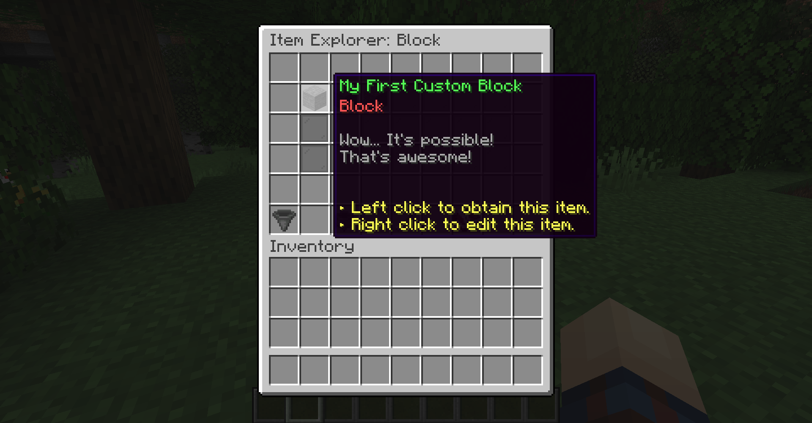
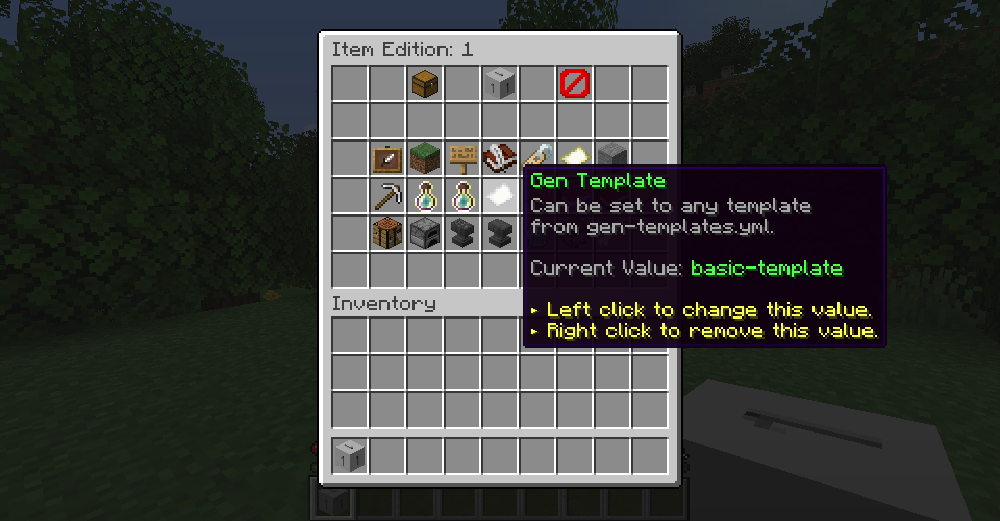

# 自定义方块

使用MMOItems 5+，您可以实现具有自定义纹理的方块。您甚至可以通过[世界生成模板](../custom-blocks/world-generation-templates)定义它们的生成频率，配置玩家用什么工具来破坏它们，决定它们的掉落物，并绑定一个随机数量的经验值。

## 创建和编辑自定义方块

您可以使用`/mi browse blocks`浏览当前的自定义方块。在使用物品浏览器时，您可以使用GUI右下角的小物品指示器切换到方块浏览器。和物品浏览器一样，您可以右键点击自定义方块来编辑它们。




以下是`blocks.yml`中的配置模板

``` yaml
1:
    display-name: "&a我的第一个自定义方块"
    lore:
    - "&7哇... 这是可能的！"
    - "&7真是太棒了！"
```

## 镐力

`required-power`定义了您的工具需要拥有的镐的力量才能破坏该方块。如果设置为3，玩家必须使用`Pickaxe Power`高于3的MMOItem工具。


默认情况下，原版镐具有如下预定义的镐的力量：

``` yaml
WOOD_PICKAXE = 5
STONE_PICKAXE = 10
GOLDEN_PICKAXE = 15
IRON_PICKAXE = 20
DIAMOND_PICKAXE = 25
NETHERITE_PICKAXE = 30
```

## 方块破坏经验值

如果添加了`min-xp`和`max-xp`，破坏自定义方块将会在`min-xp`和`max-xp`之间随机生成经验值，并像常规矿石一样在方块上生成经验球。


## 自定义纹理

如果您了解资源包和自定义模型数据的工作原理，您可以通过`block-id`定义自定义方块的`Custom Model Data`来为其添加纹理。


一个`block-id`并不一定意味着物品中的`CustomModelData`标签。如果一个物品的`block-id`为`300`，其`CustomModelData`将变为`1300`。这是因为MMOItems会在分配的`block-id`上加上`1000`作为其`CustomModelData`。一个有用的命令是`/mi debug checktag CustomModelData`，可以查看当前持有方块的标签值。


方块浏览器GUI中还包括一个下载示例材质包的链接。


## 世界生成

自定义方块可以在具有`block-id`的情况下包含在世界生成中。要将自定义方块包含在世界生成中，您需要为方块添加一个`Gen Template`，这样它将在新块加载到您的世界时被注册。有关设置/自定义生成的更多信息，请查看[世界生成模板](../custom-blocks/world-generation-templates.md)指南。

