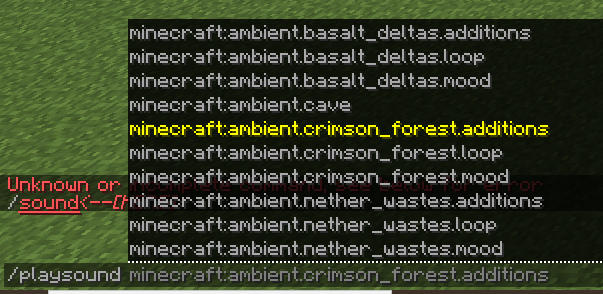

# 物品属性

编辑菜单 (_/mi edit_) 可以让你知道可以为物品添加哪些属性以及如何配置它们。虽然大多数都很直观，但以下是一些关于最复杂物品选项的说明。这个列表并不包含MMOItems中的所有物品属性或选项，所以请务必阅读整个Wiki，它包含了关于其他物品选项的信息。如果你不想使用编辑菜单，物品示例可以帮助你手动创建物品。

**使用CTRL+F查找物品属性。**

## 数值属性

**请务必先阅读**[**这一段**](../item-creation/item-creation)**。MMOItems的物品生成系统相当复杂，需要一些时间才能完全理解。**

大多数数值属性（攻击伤害/暴击几率/对抗PvE伤害/...）甚至更具体的物品选项（能力修正、药水效果持续时间/等级、附魔等级）都具有数值输入公式。这些公式适用于在RPG服务器场景中轻松提供现实的属性值，尽管你也可以选择使数值输入配置变得更加简单。

数值输入（数值属性、能力修正...）可以随着物品等级的提升而扩展。物品等级是在生成物品时“随机”选择的一个常数。一般来说，物品等级越高，属性越好。

使用的公式如下：

``` yaml
attack-damage: # 可以是任何属性
    base: 10
    scale: 2
```

`base` 是对应于0级物品的属性值。`scale` 是每增加一级所增加的属性值。使用上面的公式，如果物品等级是6，那么属性值将是 `10 + (2 * 6) = 22`。因此，通用公式为 `stat_value = base + item_level * scale`。

如果你不希望属性随物品等级扩展，可以将scale参数设置为0，或者使用以下格式：

``` yaml
attack-damage: 10
```

## 为数值属性添加随机性和真实性

在RPG游戏中，掉落的物品从来不会只有与等级相关的固定属性：它们还有一个额外的随机因素，这使得某些物品由于整体属性稍高而变好，其他物品由于整体属性稍低而变差。MMOItems对数值物品属性有类似的功能。

### 为数值属性指定范围

通过使用以下格式，属性值将在给定的上下限之间随机选择。

``` yaml
attack-damage:
    min: 10
    max: 20
```

这是实现随机属性值的简单方法。如果你不想过多地处理属性值，可以使用这个。如果你想为服务器添加更深的RPG触感，可以选择一个更现实（与RPG游戏中使用的公式相同）但设置稍微复杂的选项。

### 使用正态分布

正态分布是数学、物理、自然界等各处都可以找到的变量分布。我们将使用这种分布来确定属性值。首先看看格式，然后再详细解析。

``` yaml
attack-damage:   # 不变
    base: 10     # 不变
    scale: 2     # 不变
    spread: .1
    max-spread: .3
```

首先，记住我们希望属性值平均为 `base + item_level * scale`，因为这是没有随机性的属性值。当“应用”正态分布到属性值时，`spread` 参数是随机生成的属性值与平均值之间的平均差异。spread越大，属性值的分布越分散。spread越小，属性值越集中在平均值周围。

你应该使用大约0.1的spread，这样70%的值范围在-10%到+10%之间，95%的值范围在-20%到+20%之间。

`max-spread` 是与平均值的最大差异。你应该将此参数设置在30%到50%左右，这样正态分布不会生成过于强大的属性值。这样设置后，生成的属性值可能仍然有小概率超过平均值10倍，但为了游戏公平性，我们不希望这种情况发生。

你还可以为基于高斯分布的数值公式添加固定的上下限，使用以下格式（尽管与属性扩展配对时效用有限）：

``` yaml
attack-damage:     # 不变
    base: 10       # 不变
    scale: 2       # 不变
    spread: .1     # 不变
    max-spread: .3 # 不变
    min: 10
    max: 20
```

## 材质、耐久度

你的物品材质及其耐久度/数据。**示例：**INK_SACK 的1耐久度对应玫瑰红（1.8 - 1.12）。在1.13中使用ROSE_RED。所有材质可以在[Spigot Javadocs](https://hub.spigotmc.org/javadocs/spigot/org/bukkit/Material.html)中找到。请注意，这些材质名称对应最新的Spigot版本，因此与1.14以下版本，特别是Legacy版本不完全兼容。

## 显示名称

物品显示名称。使用'&'来添加颜色代码。**完全支持 MiniMessage 格式的十六进制颜色代码**（例如：`<#FFFFFF>` 或 `<HEXFFFFFF>`）。当生成物品时，来自修正的名称前缀/后缀将添加到基础物品名称中。

``` yaml
TEST_ITEM:
    base:
        name: '&f钢剑'
```

显示名称占位符旨在使物品创建一致，通过使物品名称统一和动态化。定义物品显示名称时，只需在某处放置占位符，它将自动被MMOItems解析。

| 占位符 | 用法 | 描述 |
|--------|------|------|
| 等级名称 | `<tier-name>` | 显示未格式化的物品等级名称。 |
| 等级颜色 | `<tier-color>` | 获取物品等级名称的颜色代码。 |
| 无色等级名称 | `<tier-color-cleaned>` | 无颜色代码的等级名称。 |

## 自定义Lore

需要明确的是，即使不使用此选项，物品也有描述。此选项仅在物品描述末尾添加几行自定义文本。你可以用它为武器添加一个小型RPG类型的描述。

你也可以使用此选项来显示物品能力。因为默认情况下显示能力的方式并不太可配置，我们添加了 **Lore 占位符** 用于能力修正，这样你可以使用此选项。例如，使用 `{ability_fireball_damage}` 将返回火球能力的伤害。

通用格式为 `{ability_<ability-_name>_<modifier_name>}`。这些占位符会在能力修正因其他插件更改时自动更新。

## 染色颜色

此参数仅用于皮革盔甲件。使用RGB（红-绿-蓝）

``` yaml
TEST_ITEM:
    base:
        material: LEATHER_CHESTPLATE
        dye-color: 100 100 100
```

## 附魔

附魔由附魔类型和等级决定。使用以下格式：

``` yaml
enchants:
    efficiency:
        base: 1
        # 虽然不存在效率1.3的附魔，但这意味着每提升10级，
        # 物品将获得额外的效率等级！这个技巧也可以用于药水效果等级。
        scale: .1
    # 这个格式仍然有效，因为附魔等级是一个数值
    sharpness: 10
```

## 物品权限

玩家使用该物品所需的权限列表。您可以使用相应的绕过权限来绕过该物品的限制。

## 攻击伤害和攻击速度

武器造成的伤害量及其攻击速度（以每秒击打次数计算）。这些属性基于原版的属性修正。

当同时持有两件物品时，这些属性具有特定的行为。虽然包括副手催化剂在内的配件可以在持有时增加攻击速度和伤害，但持有副手武器不会增加攻击速度和伤害，因为这些属性与副手武器有关，而您并未将其作为主武器使用。

## 暴击几率与威力

物品造成暴击的几率，以百分比表示。暴击会造成初始伤害的 `250%`（可在MythicLib配置文件中配置）。暴击威力对应于暴击造成的初始伤害百分比。

自MythicLib更新以来，MMOCore技能和MMOItems物品能力也能造成暴击，所有暴击选项可在MythicLib主配置文件中编辑。

## 射程

鞭子/法杖的射程。默认值为 `18`。此处的单位并非严格为方块，需将该值乘以约 `2.5` 以换算成方块数。

## 钝击力量与评分

钝击力量对应于钝击攻击的半径。半径越大，可以同时击中的敌人越多。钝击评分对应于钝击攻击造成的伤害量，以初始伤害的百分比表示。例如：`钝击力量=3 | 钝击评分=70%` 当击中一个实体时，距离3单位内的敌人将受到初始伤害的70%。

``` yaml
BLUNT_ITEM:
    base:
        material: IRON_HAMMER
        blunt-power: 3
        blunt-rating: 70
```

## 不可破坏

设置为true时，武器永不损坏。如果您计划通过耐久度机制给物品自定义纹理，此选项必不可少。

## 不可堆叠

设置为true时，您的物品将不会自行堆叠。

## 护甲和护甲韧性

护甲和护甲韧性是护甲给予玩家的属性。这些属性对应于原版Minecraft的玩家属性。护甲和护甲韧性减少受到的伤害。您可以访问官方MC维基了解护甲和护甲韧性如何计算伤害，但简而言之：护甲减少伤害，护甲韧性减少护甲的减少效果。这些属性在 `1.8` 版本中不受支持，因为相应的 `Minecraft` 属性是在 `1.9` 版本中添加的。

## 防御

此属性决定玩家的防御值，可以是任何正数。任何物品类型都可以赋予此属性。防御伤害减免的公式可在 `Mythiclib` 的 `config.yml` 文件中编辑。

如果您对默认防御公式感兴趣，以下是一个图表，显示了防御点数与伤害减免百分比的关系


下面是一个表格，显示了特定输入伤害量和防御点数对应的伤害值


## 移动速度

物品给予持有者/穿戴者的移动速度。默认Minecraft移动速度为0.2。如果将物品的额外移动速度设置为0.02，则相当于+10%的移动速度。

## 双手武器

如果玩家同时持有两件物品，其中一件为双手武器，他的移动速度会显著减慢。使用特定配置选项可以使玩家在持有两件重物品时无法使用任何物品。

## 永久药水效果

与消耗性药水效果的格式相同（见上文），但由于这些药水效果在玩家持有物品时应一直应用，因此不必指定效果持续时间。`level`配置部分也省略了，因为这样更简洁。

``` yaml
perm-effects:
    speed:
        base: 1
        scale: 1
    # 这个格式也有效
    haste: 3
```

## 物品冷却时间

玩家在使用消耗品或执行物品命令前必须等待的时间。MMOItems Legacy中，命令可以有不同的冷却时间，消耗品有一个称为 `Consume Cooldown` 的选项，与 `Item Cooldown` 类似。

## 工具选项

**自动冶炼:** 开启时，工具会自动冶炼采矿的铁矿和金矿。**弹跳裂纹:** 开启时，工具会挖掘初始块后面的额外方块。

## 物品元素属性

``` yaml
element:
    fire:
        defense: 
            base: 10
            scale: 3
        # 这个格式仍然有效！
        damage: 10
    water:
        defense: 50
```

## 物品指令

右键点击物品时执行的指令列表。指令可能有冷却时间和延迟，之后会自动执行。您可以使用此选项创建例如使用 `/spawn` 指令传送回家的消耗品。**警告**：指令冷却时间与消耗品冷却时间不同，因此您需要确保它们一致，否则消耗品可能会被消耗而未执行指令。您可以安装PAPI Player扩展（`/papi ecloud download Player`）并使用 `%player_name%`占位符来获取命令发送者的名称。

``` yaml
TEST_ITEM:
    base:
        material: PAPER
        name: '&rScroll of Cowardness'
        commands:
            '1':
                command: spawn
                cooldown: 10
                delay: 1
```

## 箭矢粒子效果

此选项可用于显示由弓射出的箭矢周围的粒子效果。粒子效果可以完全配置（类型、速度、颜色）。

``` yaml
MARKING_BOW:
    base:
        material: BOW
        arrow-particles:
            particle: SMOKE_NORMAL
            amount: 3
            speed: 0.05
```

## 装备优先级

为护甲件分配优先级，然后当您手持mmoitems护甲右键点击时，如果该物品的装备优先级高于或等于当前装备的护甲优先级，它将自动为您交换护甲。

``` yaml
DIAMOND_CHESTPLATE:
  base:
    material: DIAMOND_CHESTPLATE
    tier: COMMON
    unbreakable: true
    equip-priority: 4.0
```

此功能可以在Config.yml中通过编辑 `auto-equip-feature: false` 完全禁用或启用。

## 所需等级

使用武器/物品所需的等级。此限制完全支持RPG核心插件的等级。

## 所需职业等级

此属性决定玩家是否可以使用该物品，取决于所需的职业等级。需要MMOCore。

## 头颅纹理（仅用于玩家头颅）

用于自定义头颅的头颅纹理。对于1.13版本，使用PLAYER_HEAD材质获取玩家头颅物品。旧版本用户必须使用耐久度为3的SKULL_ITEM。此属性的配置格式相当奇怪，因为自定义纹理头颅存在特定问题。

``` yaml
SKULL_ITEM:
    base:
        skull-texture:
            value: eyJ0ZXh0dXJlcyI6eyJTS0lOIjp7InVybCI6Imh0dHA6Ly90ZXh0dXJlcy5taW5lY3JhZnQubmV0L3RleHR1cmUvOTdlMmY0OTQyNDNhY2FkM2Y0ODQ0YmM1YWUyZDVmZDUzZTY5MjczMzA0YzlkYmY1YmQxMzA5NDlmYTEzMjk4ZiJ9fX0=
            uuid: 62a6ff60-98f3-4769-9dd6-2b5fe5e8046f
```

您必须指定一个随机UUID（使用一个 [随机UUID生成器](https://www.uuidgenerator.net/)），因为Minecraft需要一个（随机玩家）UUID来识别头颅为纹理玩家头颅。MMOItems以前为每个物品使用一个完全随机的UUID，但由于头颅具有不同的UUID存储在NBTTags中，导致头颅无法堆叠。

如果您使用物品编辑GUI输入头颅纹理值，MMOItems会为您生成一个随机UUID。您可以在Minecraft Heads或类似头颅数据库上找到头颅纹理值。例如，导航到 [这个页面](https://minecraft-heads.com/custom-heads/food-drinks/49818-hamburger-on-a-plate) 的底部找到头颅值，如下所示：


## 法杖灵魂

法杖灵魂选项会改变法杖/魔杖左键的基础攻击。
您可以使用 `/mi list staff` 查看法杖灵魂列表。

## 宝石插槽

在物品上拥有宝石插槽允许您将宝石镶嵌在其上。宝石可以提升物品属性。每个绑定的宝石占据一个宝石插槽。更多信息请查看[此维基页面](../main-feature/gem-stones)。

## 禁用交互

启用时，此选项将禁用右键点击/放置物品时可能发生的任何事件。它会阻止方块放置和物品使用（雪球、可可豆、树苗等）。

## 不可食用和禁用右键消耗

不可食用完全禁用右键物品事件。
禁用右键消耗仅防止右键点击时消耗物品。您仍然可以食用它，但它不会被消耗。

## 物品粒子效果

持有/穿戴物品时显示一些粒子效果。物品粒子效果由三个部分定义：粒子模式及其模式修饰符，以及实际使用的粒子。

**粒子模式**定义粒子的行为、形成的形状等。例如，选择螺旋粒子模式将使粒子在您周围形成一个上下移动的圆圈。

**粒子**是粒子效果中实际使用的粒子。例如，选择红石粒子与螺旋模式将使红石粒子在您周围形成一个螺旋。您可以在 [这里](https://hub.spigotmc.org/javadocs/spigot/org/bukkit/Particle.html) 查看可用粒子列表，但请注意，其中一些粒子不适用于MMOItems。

然后，您可以通过更改**粒子修饰符**来稍微调整粒子效果，例如更改螺旋的基准y偏移量、半径、高度、显示速度等。
一些粒子是**可着色的**，例如红石粒子。这意味着您可以编辑它们的颜色，使粒子效果更加独特。颜色可以通过输入红色、绿色和蓝色（RGB）三个颜色级别来设置。

``` yaml
FIRE_GREATLANCE:
    base:
        material: BLAZE_ROD
        item-particles:
            type: DOUBLE_RINGS
            particle: FLAME
            radius: 1.3
            rotation-speed: 0.4
            // 这显示了两个缓慢围绕玩家旋转的火焰环
```

以下是可用粒子类型列表：OFFSET, FIREFLIES, VORTEX, GALAXY, DOUBLE_RINGS, HELIX, AURA。

## 火枪属性

有两个主要的物品属性可以用来定制火枪。火枪是特殊的远程武器，右键点击时发射子弹。击退属性定义了玩家开火时的击退力，因此必须为正值。后坐力定义了射击的准确性，例如设置为5时，射击会在光标周围随机偏移5°。

## 琵琶属性

琵琶是远程武器，右键点击时会发射音乐弹幕。琵琶有不同的攻击效果（编辑任何琵琶攻击效果时会提示所有可用效果列表），这些效果定义了弹幕的外观。您还可以更改攻击时播放的声音。设置为大于0的任意值时，音符重量会使弹幕随时间略微向下倾斜，仿佛受到重力牵引。

## 自定义物品声音

自定义物品声音是在执行特定动作（如攻击实体、右键点击物品、拾取物品等）时播放的声音。**警告**，这些声音不对应Spigot javadocs的声音名称，而是对应原版的声音名称，如 `entity.zombie.attack_iron_door`（而非`ENTITY_ZOMBIE_ATTACK_IRON_DOOR`）。

您也可以使用服务器资源包中的声音。您可以在网上找到 **默认** 声音列表，例如在 [pastebin.com](https://pastebin.com/gLMhUyis) 上，甚至使用 `/sound` 自动命令补全器。


