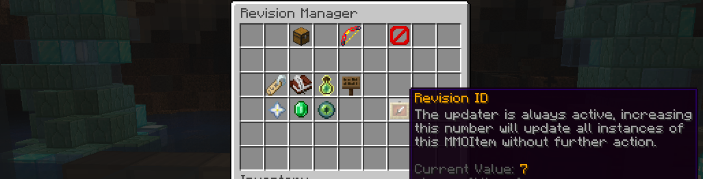

# RevID

## 使用RevID属性保持物品更新

当您在编辑器中增加此数字时，世界中该物品的所有副本将更新以匹配模板：



当“更新”一个物品时，目标基本上是重新生成它，就像用`/mi give`命令新获得的一样，具有最新的描述格式和与模板相同的属性：


## 高级配置

这个修订系统有很多选项，您可以在配置文件的`item-revision`部分中进行调整。

``` yaml
item-revision:
  keep-data:
    display-name: true
    enchantments: true
    soulbound: true
    gems: true
    upgrades: true
    lore: false
    kept-lore-prefix: '&7'
    external-sh: true
    reroll: false
    modifications: true
    skins: true
    tier: true

  drop-extra-gems: true
```

有些选项有更复杂的机制，但大部分选项是显而易见的。

### 重置随机属性 `reroll`

此选项具有非常复杂的行为，即使您将其设置为false，属性仍可能会重新计算，这是有益的。重要的是要理解所有数值属性都是随机的——即使您没有指定范围，它们也有100%的几率保持相同值。

假设此选项已启用，那么物品的所有数值属性将重新计算。

假设此选项已禁用，那么每个数值属性将在当前的平均值和范围设置下计算其再次生成的概率，如果它太稀有，则即使此选项被禁用，它也会更新/重新计算：

1. 如果新值的范围为0且发生了变化，旧值将丢失，因为生成的几率为0%。
2. 如果该值完全从物品中删除，旧值将丢失。
3. 如果该值的范围变化，使得旧值极其稀有（1/4200），则旧值将丢失。
4. 如果最大范围值发生变化，而旧值超出了此范围，则旧值将被限制在最大范围内。

如您所见，如果该物品在新条件下将无法获得，随机属性将重新计算，这对于游戏设计是健康的。

### 保持附魔 `enchantments`

物品的旧附魔将与模板中的附魔进行比较，以决定附魔是保留还是更新：

1. 任何比模板差的旧附魔将更新为更好的值。
2. 如果旧附魔比模板好，只要它在原版Minecraft中可以获得，它将被保留。
3. 如果模板启用了`disable-enchanting`和`disable-repairing`属性，即使此选项启用，旧附魔也不会保留，所有附魔将更新以匹配模板。

如您所见，目标是让玩家在附魔他们的物品时不会失去附魔，但如果模板中的物品更新为更好的附魔，这些玩家将获得更好的附魔。基本上，尝试记住玩家在物品上放置的附魔，并在玩家仍然可以应用这些附魔时再次应用它们。

### 保持宝石 `gemstones`，`drop-extra-gems`

需要注意`drop-extra-gems`选项，如果由于RevID更新器删除了任何宝石，将此选项设置为true将使它们回到玩家身边或在其库存满时掉落在附近。此选项对所有物品修订操作都是全局的（请参见下一部分了解更多RevID系统的应用）。

如果此选项被禁用，物品中的所有旧宝石将被删除（~ 或者如果启用了`drop-extra-gems`选项，将被掉落）。

如果此选项被启用，旧宝石仍然可能被删除：

1. 如果模板移除了其宝石插槽或减少了数量，不适合的宝石将被删除。
2. 如果宝石插槽的颜色发生变化，不再适合的宝石将被删除。

### 保持名称 `display-name`

如果此选项启用，那么物品的旧名称将被保留，而不管模板当前的名称。

### 保持绑定 `soulbound`

如果旧物品是绑定的，这个绑定将被保留。

### 保持升级 `upgrades`

旧物品的升级等级将被保留，但如果物品模板不再有升级模板，这将失败。如果物品的最大升级数减少，额外的升级等级将丢失。

### 保持描述 `lore`，`kept-lore-prefix`

从旧物品中，所有以 `<span dir="">`kept-lore-prefix`</span>`（通常是颜色代码）开头的描述行将被保留。请注意，如果模板有任何以此前缀开头的描述，每次更新物品时都会保留它，这可能导致描述重复。

### 保持外部SH `external-sh`

外部状态历史数据由第三方插件添加，用于修改物品的属性。启用此选项将保留所有这些数据，除了附魔。

### 保持修改 `modifications`

如果启用此选项，所有物品修改器将被保留，即使它们不能再获得，即使修改器权重发生变化。

### 保持皮肤 `skins`

如果启用此选项，由_皮肤类型_物品所做的更改将被保留。

### 保持等级 `tier`

如果旧物品有等级，这个等级将被保留，即使模板现在有不同的等级。

## RevID系统的其他应用

### 更新物品内的宝石

`RevID` 系统支持在物品内更新宝石。当增加宝石模板的 `RevID` 时，不会自动发生此操作，您必须增加父物品的`RevID`并启用 _keep gemstones_ 选项。

您可以使用`item-revision.keep-gem-data`字段来指定这种方式更新的宝石的`RevID`选项：

``` yaml
item-revision:
  keep-gem-data:
    display-name: true
    enchantments: true
    ...
```

## 第三方插件兼容性

### 保持高级附魔 `advanced-enchantments`

物品中的所有高级附魔将被保留。

### 更新PhatLoots战利品生成

PhatLoots不支持MMOItems，几个月后，您的MMOItem战利品掉落可能会变得不再更新！在 `MMOItems` 的 `config.yml` 文件中，在`item-revision.phat-loots`部分指定修订选项，以在生成这些物品时更新它们：

``` yaml
item-revision:
  phat-loots:
    display-name: true
    enchantments: true
    ...
```
