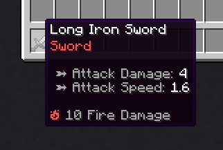
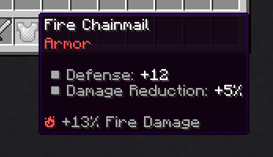
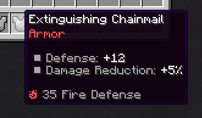

# 元素

> [!WARNING]
> 此页面为 [MythicLib wiki](https://gitlab.com/phoenix-dvpmt/mythiclib/-/wikis/Custom%20Elements) 的部分。

元素在RPG服务器中占有重要地位。使用MythicLib的自定义元素，您可以创建具有完全可配置攻击效果的元素攻击。您还可以设置元素暴击，这些攻击在造成元素伤害时有一定几率触发。自定义元素在MythicLib 1.3.4中引入。

您将编辑的配置文件是`/MythicLib/elements.yml`

## 元素攻击

技能可以使用以下MythicMobs机制来造成**元素伤害**，其中您可以将`FIRE`替换为任何元素标识符。

``` yaml
mmodamage{amount="10";types=PHYSICAL,WEAPON;element=FIRE}
```

在进行武器（近战或远程）攻击时也会触发元素攻击。

## 伤害计算

### 传入伤害

有两种不同的属性可以增加玩家的元素伤害。您可以像这个物品一样给予**固定数量**的元素伤害。以下物品在命中时会额外造成10点伤害。相应的属性是`<ELEMENT_NAME>_DAMAGE`，例如`FIRE_DAMAGE`。



您还可以使用`<ELEMENT_NAME>_DAMAGE_PERCENT`，这会增加一定系数的元素伤害。例如，穿戴以下物品将增加13%的火焰伤害。由于它是伤害倍增器，如果没有物品造成基础/固定伤害，您将不会造成任何火焰伤害。



### 防御

元素防御减少传入的元素伤害。属性`<ELEMENT_NAME>_DEFENSE`提供固定防御，而`<ELEMENT_NAME>_DEFENSE_PERCENT`提供额外的元素防御点。



### 弱点

元素弱点会增加受到的元素伤害。例如，10%的火焰弱点会增加10%的传入火焰伤害。相应的玩家属性是`<ELEMENT_NAME>_WEAKNESS`。


### 最终公式

以下公式总结了前面的解释。最后一个公式使用了默认的MythicLib防御公式。

``` txt
有效伤害  = <固定伤害> * (1 + <额外伤害>) * (1 + <对手弱点>)
有效防御 = <固定对手防御> * (1 + <额外对手防御>)
伤害减免 = <防御> / (<防御> + 5 * <伤害>)
```

## 配置示例

``` yaml
FIRE:
    
    # MMOCore和MMOItems将使用的主要翻译
    name: Fire
    
    icon: BLAZE_POWDER # 纯粹是装饰性，用于MMOItems物品编辑器中
    lore-icon: '🔥' # 用于MMOItems物品说明中
    color: '&c' # 用于MMOItems物品说明中
    
    # 正常元素攻击时执行的内容
    regular-attack:
        mythiclib-skill-id: fire_elemental_attack
    
    # 元素暴击时执行的内容
    # 这个是可选的。如果未指定，则不会发生暴击
    crit-strike:
        mythiclib-skill-id: fire_critical_strike
```

每个元素都有一个配置部分，您可以随意添加、编辑和删除任何配置部分。编辑完成后，您可以使用`/ml reload`重新加载新配置到MythicLib。然后使用`/mi reload`或`/mmocore reload`将更改传播到MMOItems和MMOCore。

`name`、`icon`、`lore-icon`和`color`选项都是装饰性的。最重要的是`regular-attack`，这是执行元素攻击时施放的技能，以及`crit-strike`，这是进行元素暴击时施放的技能。默认情况下，MythicLib使用自定义脚本处理这些攻击技能，但您可以使用其他插件如MythicMobs或SkillAPI。

### 使用其他技能插件

如果您想使用MythicMobs技能，只需将`mythiclib-skill-id`更改为`mythicmobs-skill-id`（并指明正确的MM技能标识符）。如果您使用SkillAPI或ProSkillAPI，也可以使用`skillapi-skill-id`。这是相同的配置部分，只是配置键有所更改：

``` yaml
FIRE:
    name: Fire
    icon: BLAZE_POWDER
    lore-icon: '🔥'
    color: '&c'
    regular-attack:
        mythicmobs-skill-id: fire_elemental_attack
    crit-strike:
        mythicmobs-skill-id: fire_critical_strike
```

### 默认元素攻击效果

MythicLib为每个默认元素预配置了攻击效果，虽然您可以根据喜好进行调整。默认情况下，元素攻击效果（这些是自定义的MythicLib脚本）保存在`/script/element-attacks.yml`配置文件中。普通元素攻击将在目标实体周围显示一些粒子效果。元素暴击具有额外的命中效果，这些效果取决于元素，以下是默认效果：
| 元素    | 暴击效果 |
|---------|-------------|
| 火      | 将目标实体点燃（持续时间随攻击伤害增加） |
| 冰      | 使目标实体定身（持续时间随攻击伤害增加） |
| 风      | 范围击退 |
| 土      | 范围击飞 |
| 雷      | 对附近实体造成初始攻击伤害的20% |
| 水      | 范围减速（持续时间随攻击伤害增加） |

## 伤害指示器

在对实体造成伤害时会显示元素伤害。了解更多关于[伤害指示器的信息](https://gitlab.com/phoenix-dvpmt/mythiclib/-/wikis/Damage-System#damage-indicators)。

